# MariaDBをインストールする

## MariaDBとは
MariaDB(マリアディービー)とはMySQLから派生したオープンソースの関係データベース管理システム（RDBMS)です。  
MySQLと互換性があり、Googleにも採用されています。  
また、多くのストレージエンジンを採用していることやスレッドプールが標準で利用できることも魅力の1つです。

## MariaDBを使ってみよう

### 公式サイトからダウンロード
公式サイト(https://mariadb.org/)からダウンロードできます。  
任意のブラウザを起動し、上記URLを入力します。  
今回はMicrosoft Edgeを使用しています。  
下記のページが表示されます。  
ページ上段のメニューに表示されている「Download」をクリックします。

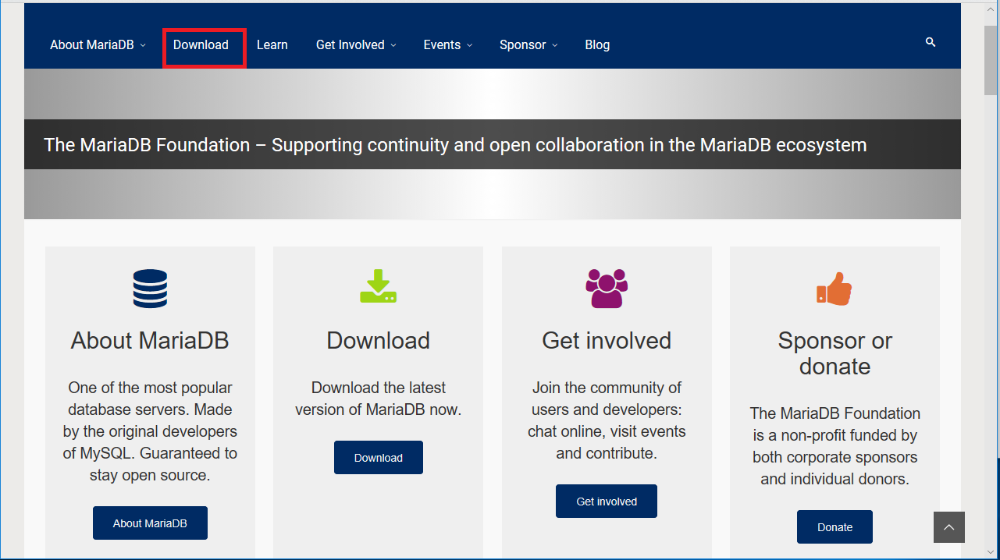{ width=400px }

\newpage

下記のページが表示されます。  
ページ中央「Download」をクリックします。

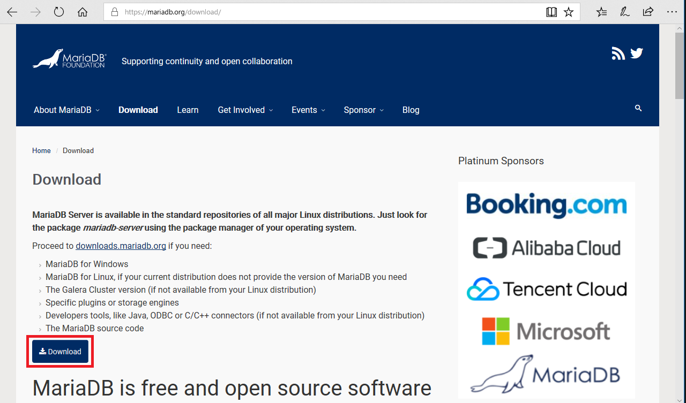{ width=400px }

下記のページが表示されます。  
ページ中央「Download 10.3.7 Stable Now!」をクリックします。

{ width=400px }

\newpage

下記のページが表示されます。  
このページでは「OS/CPU」からインストールしたいOSのMariaDBを選び、  
「File Name」をクリックして実行ファイルをダウンロードします。  
今回は「Windows x64」、msiのインストーラをダウンロードします。

{ width=400px }

下記のページが表示されます。  
ブラウザによってはファイルに対する操作を要求されるので「保存」を選択します

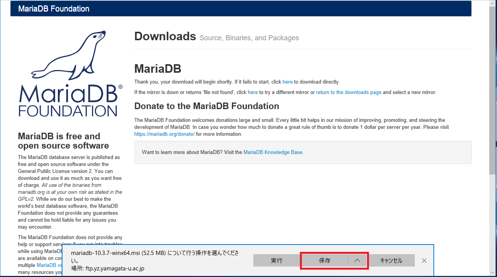{ width=400px }

ダウンロードしたファイルを実行し、インストール作業を行います。

\newpage

### インストール

それでは、インストーラを実行し、インストール作業を行います。
実行すると初期画面が表示されます。
「Next」をクリックします。

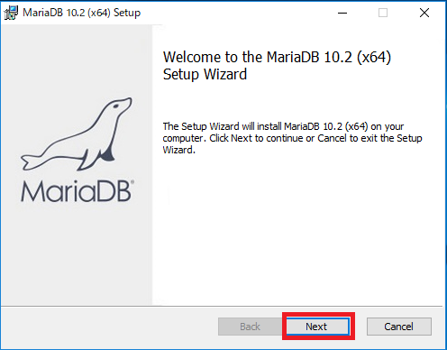{ width=400px }

利用規約の画面が表示されます。  
I accept the terms in the License Agreementにチェックをいれます。  
「Next」をクリックします。

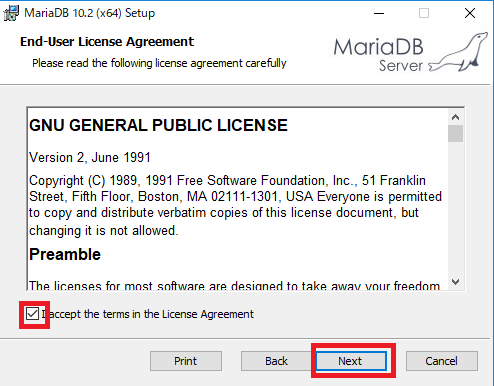{ width=400px }

\newpage

インストールするモジュール選択の画面が表示されます。  
今回はこのままインストールを続けます。  
「Next」をクリックします。

{ width=400px }

設定を行う画面が表示されます。  
rootユーザーに任意のパスワードを入力します。  
確認用にもう一度パスワードを入力します。  
また、Use UTF8 as default server's character setにチェックを入れます。  
「Next」をクリックします。

{ width=400px }

\newpage

利用するサービスの設定画面が表示されます。  
今回はこのまま続けます。
「Next」をクリックします。

{ width=400px }

フィードバックプラグインの有効化の確認画面が表示されます。  
今回はこのままで続けます。  
「Next」をクリックします。

{ width=400px }

\newpage

インストール開始の確認画面が表示されます。  
「Install」をクリックします。

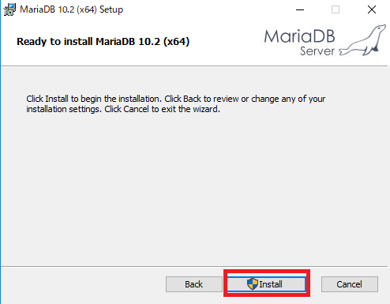{ width=400px }

インストール中の画面が表示されます。  
インストール状況を確認できます。

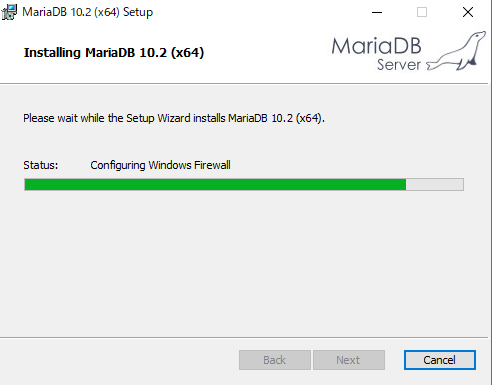{ width=400px }

\newpage

インストール完了画面が表示されます。  
「Finish」をクリックしてインストーラを終了します。

{ width=400px }

以上で、インストール作業が完了します。

\newpage

### データベースへ接続

本項では、データベースへ接続する方法について説明します。  
まず、スタートメニューから「HeidiSQL」をクリックします。

{ width=350px }

セッションを作成する画面が表示されます。  
「新規」をクリックします。

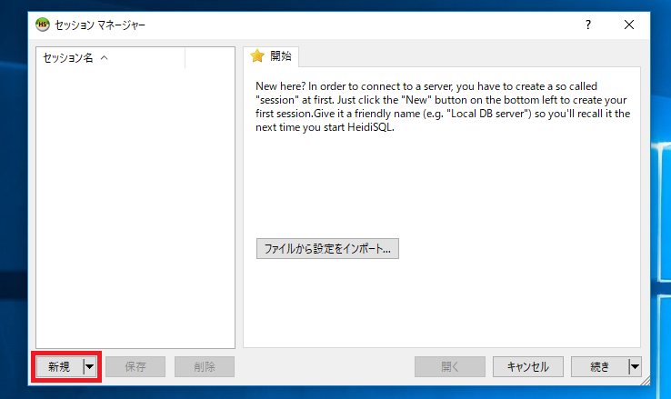{ width=350px }

ネットワーク識別項目にMySQLを選択します。  
パスワード項目にインストール時に設定したパスワードを入力します。  
「開く」をクリックします。

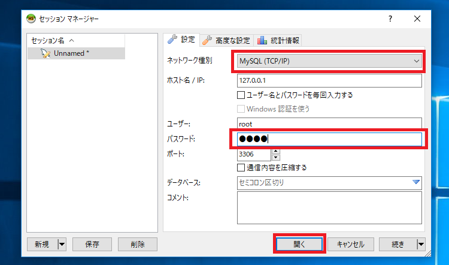{ width=350px }

\newpage

接続に成功すれば、下記の画面が表示されます。

{ width=350px }

以上で、データベースとの接続は完了です。

\newpage

## データベースの用語を整理する

本項目では、データベースの基本的用語を下記の画像と合わせて紹介します。

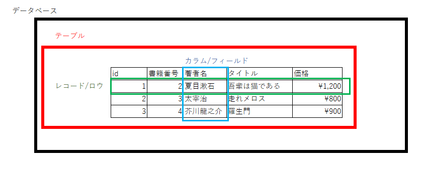

### データベース

データを管理するための入れ物のことを「データベース」と呼びます。

### テーブル

データベースに作成できる入れ物のことで、データを実際に格納する場所です。  
また、表のような構造になっています。

### レコード

テーブルの行のことです。ロウとも呼びます。

### カラム

レコードを構成する属性のことです。フィールドとも呼びます。

\newpage

## データベースの作成

データベースへの接続完了後の画面から説明します。

{ width=400px }

画面左側で右クリックし、新規作成を選択します。  
新規作成欄の「データベース」をクリックします。

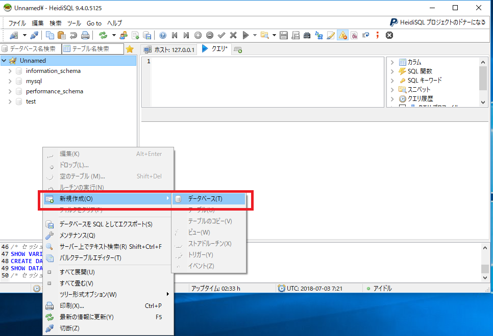{ width=400px }

\newpage

作成するデータベース名を入力するポップアップが表示されます。  
今回は、「testdb」というデータベースを作成します。  
名前を入力し、「OK」をクリックします。

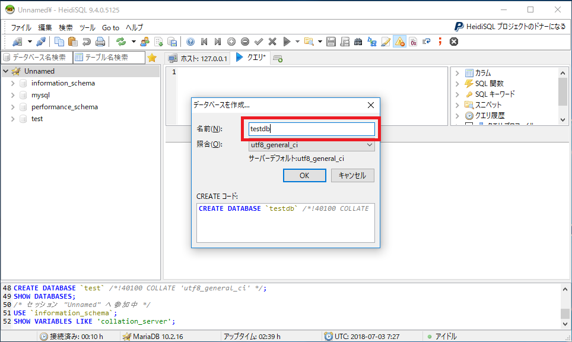{ width=400px }

作成されたデータベースは画面左側で確認できます。

{ width=400px }

\newpage

### データベースの削除

画面左側のデータベースを右クリックし、ドロップをクリックします。  
今回は、「test」を削除します。
削除確認のポップアップが表示されます。

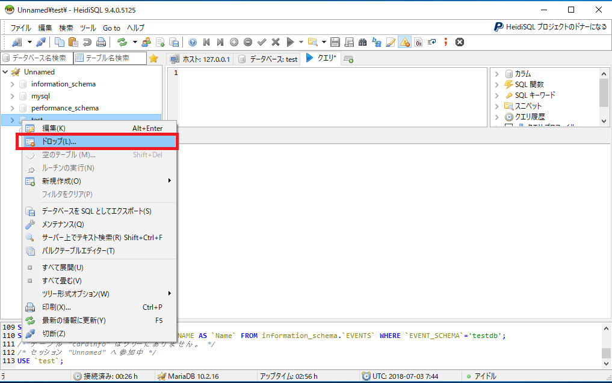{ width=400px }

OKをクリックします。

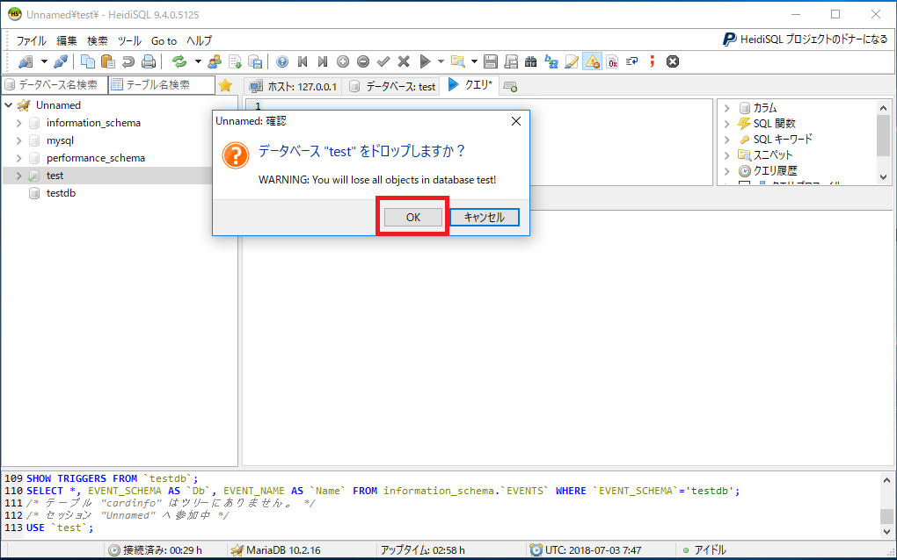{ width=400px }

\newpage

画面左側に削除されたデータベースが表示されていないことを確認します。

{ width=400px }

### データベースの切り替え

操作対象のデータベースを指定するときは、  
画面左側のデータベース名をクリックします。  
また、現在操作対象のデータベースには緑色のチェックが表示されています。

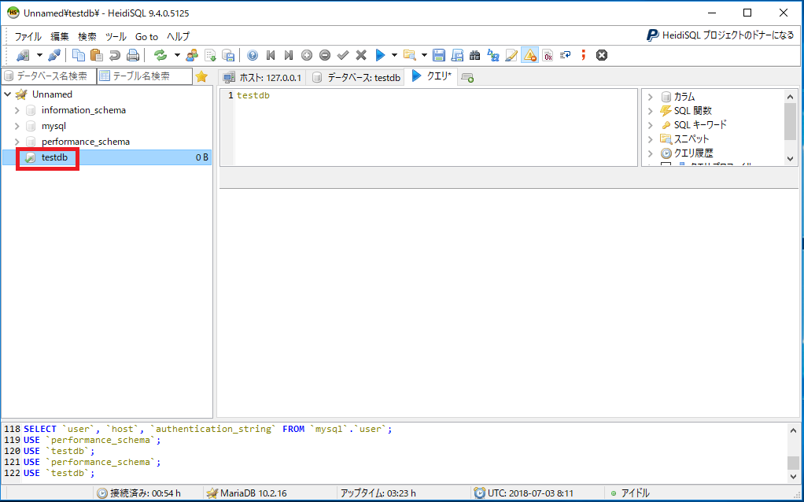{ width=400px }

\newpage 

## 作業を行うユーザを設定する

ルートユーザでは扱える権限が広く、誤った操作をしてしまうと影響が大きいため、  
データベースごとに作業用ユーザを作成することが一般的です。

ここでは、作業用ユーザの作成方法を説明します。  
まず、画面上段のメニューユーザ認証と特権の管理と表示されるアイコンをクリックします。  
ユーザーマネージャーが表示されます。

{ width=400px }

この画面ではユーザーの作成及び権限を与えることができます。  
まず、左側の追加ボタンをクリックします。

{ width=400px }

\newpage

右側に名称未定のアカウント情報入力画面が表示されます。

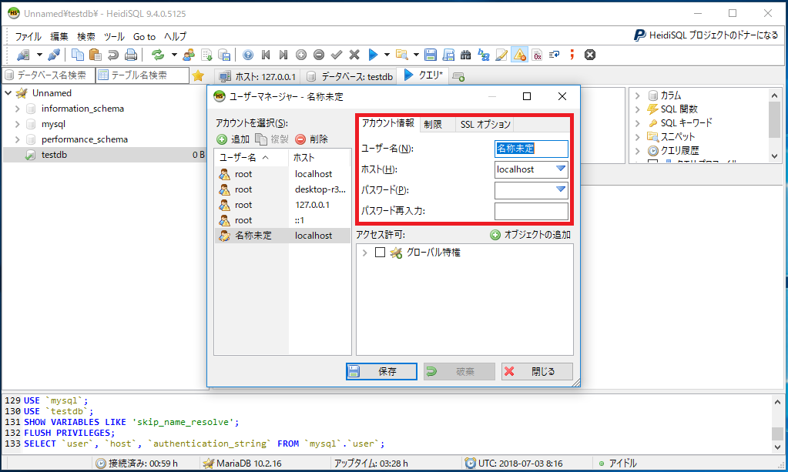{ width=400px }

今回は、「testuser」というユーザ名で作成します。  
ホストはデフォルトの状態で続けます。  
パスワードは任意のものを入力し、確認用にもう一度入力します。

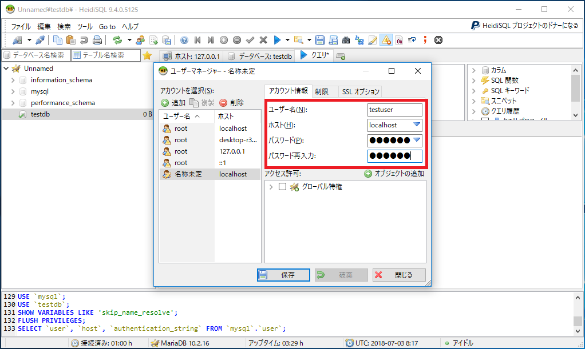{ width=400px }

\newpage

次に、このユーザに権限を与えます。  

アクセス許可項目にグローバル特権にチェックを入れます。  
グローバル特権によってこのユーザはすべてのデータベースに対する操作が可能になりました。  
保存ボタンをクリックします。

{ width=400px }

画面左に「testuser」が作成されたことを確認します。

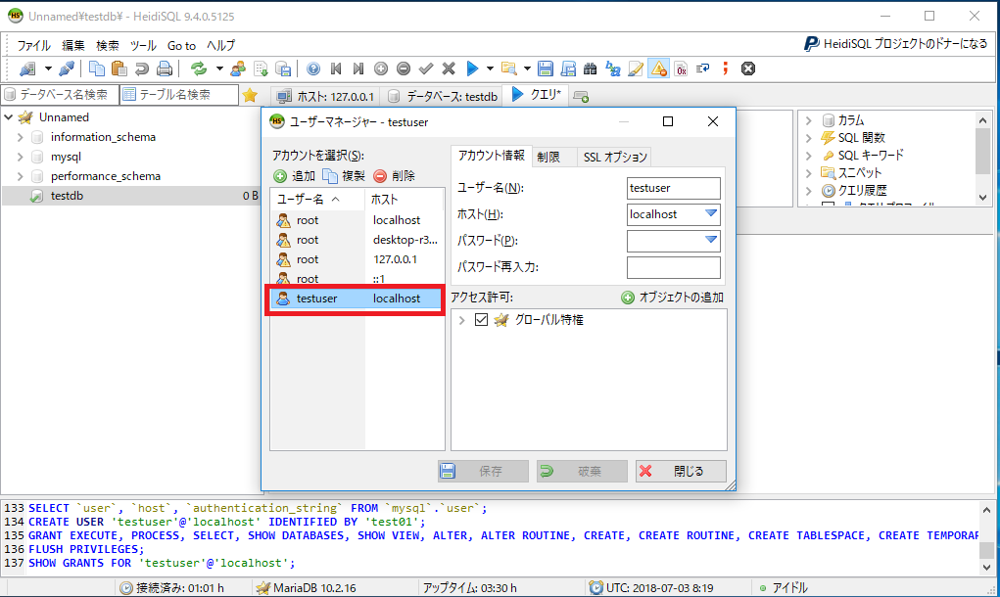{ width=400px }

\newpage

## テーブル作成

それでは、実際にテーブルの作成を行いましょう。  
画面左のデータベースを右クリックし、新規作成項目からテーブルをクリックします。

{ width=400px }

作成するテーブルの内容を入力する画面が表示されます。  
まず、右画面に表示された基本タブにある名前項目にテーブルの名前を入力しましょう。  
今回は、「book」と入力します。

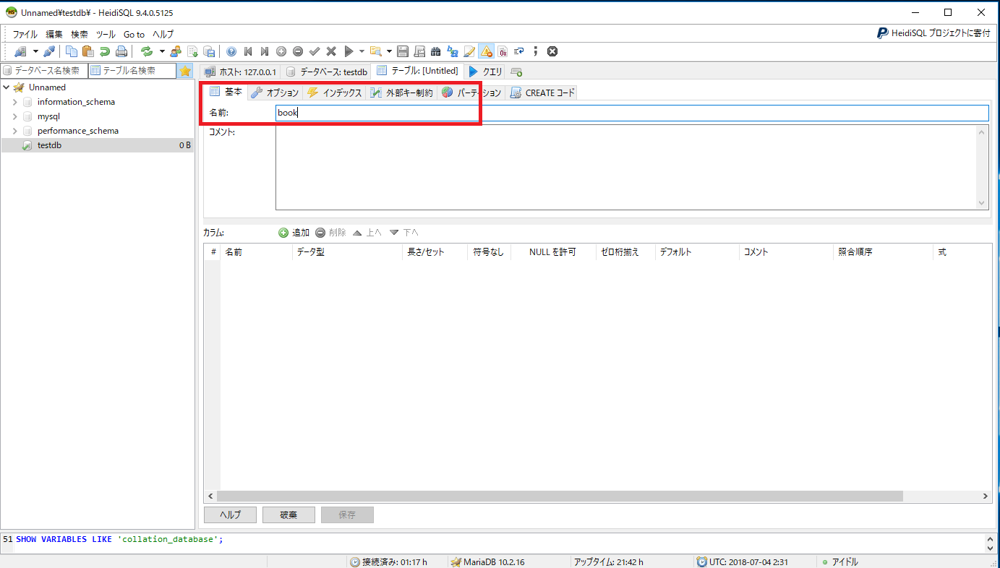{ width=400px }

\newpage

次に、テーブルに行を追加しましょう。  
画面中央のカラムという項目の「追加」をクリックします。

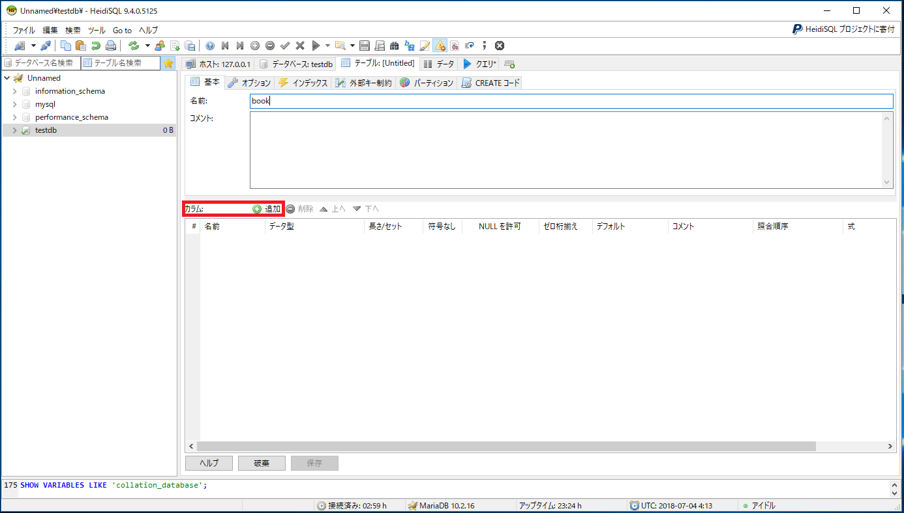{ width=400px }

「カラム１」という名前の行が表示されます。

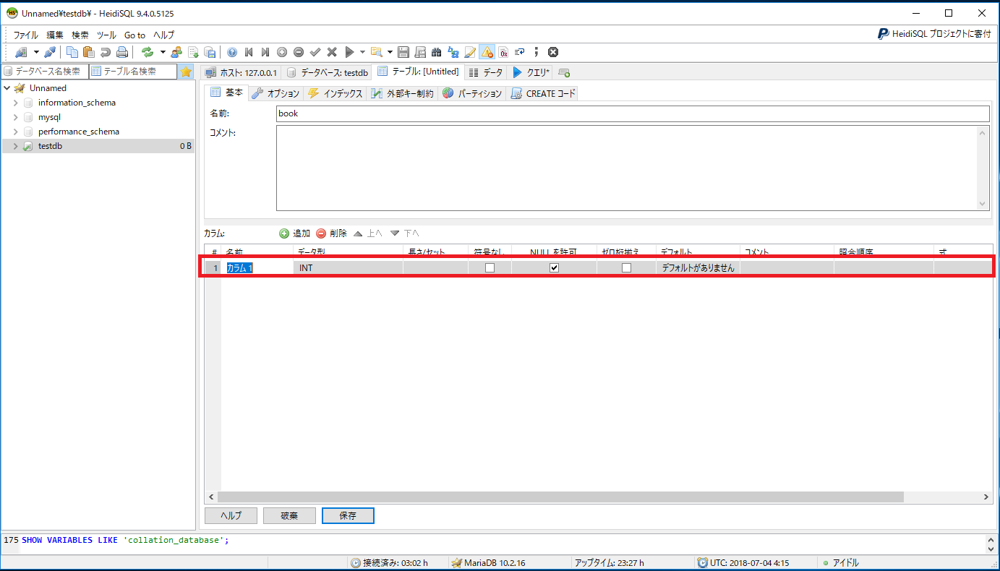{ width=400px }

\newpage

この行を編集し、データ型や長さ、NOT NULL制約や初期値の設定を行います。  
今回は、「id」と入力し、データ型をINTにします。長さは10と入力します。  
その他の項目はデフォルトの状態で続けます。

{ width=400px }

同様にして、行の追加を行います。  
下記の画面のように行を追加します。

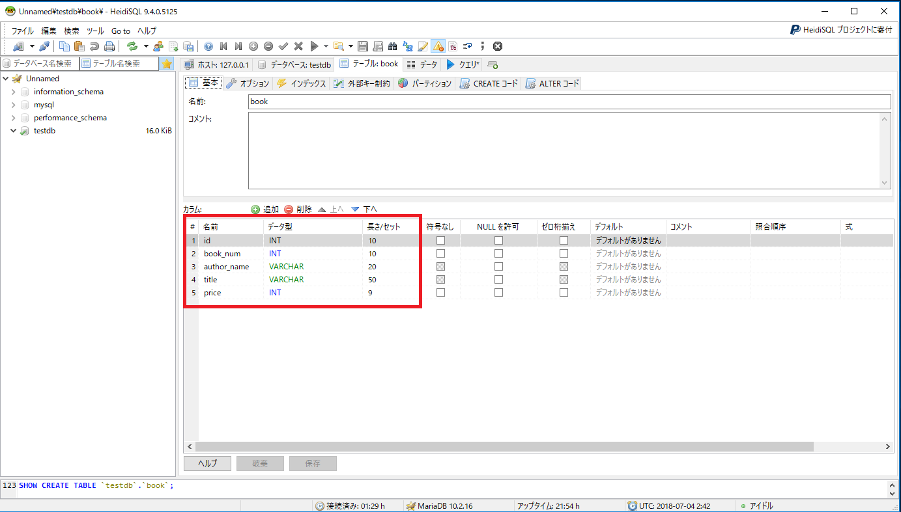{ width=400px }

作成したテーブルは、画面右のデータベースタブをクリックするとテーブル一覧を見ることができます。

\newpage

## テーブルを操作する

それでは、作成したテーブルの操作を行いましょう。  
本項目では、以下の操作について紹介します。  
操作を行うためには、画面右側のクエリータブをクリックします。  
クエリータブにテーブルを作成するクエリーが残っていた場合は削除します。

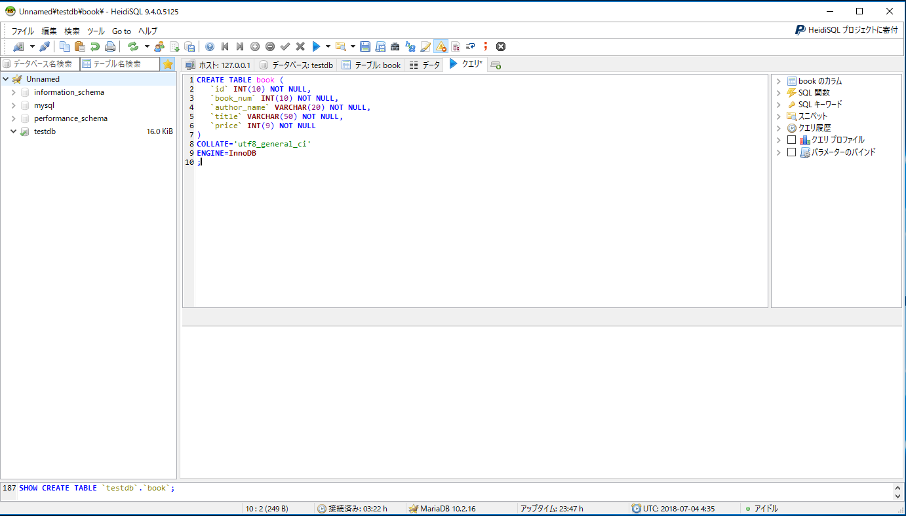{ width=400px }

### データの挿入  (INSERT INTO文)

データの挿入にはINSERT INTO文を実行します。  
構文は INSERT INTO テーブル名(テーブルのカラム名)  
VALUES(カラムごとに挿入するデータ)となります。(行番号1)  
また、テーブルのすべてのカラムに値を挿入するときは  
テーブル名の後に記述するテーブルのカラム名を省略することができます。(行番号2)  
今回は、以下を入力します。
``` sql
INSERT INTO book('id','book_num','author_name','title','price')
VALUES('1','2','夏目漱石','吾輩は猫である','1200');
```
同様にさらにデータを挿入します。
``` sql
INSERT INTO book('id','book_num','author_name','title','price')
VALUES('2','3','太宰治','走れメロス','800');
```

このようなデータを操作する文をクエリーと呼びます。  
クエリーを入力するときはカラム名をシングルコーテーションで囲みます。  
これはすべてのクエリーで共通の条件となります。  
また、上記の構文では大文字で表記していますが、MariaDBでは大文字と小文字の区別はないため下記の画像のように小文字で入力しても実行可能です。  

ただし、設定によってテーブル名とカラム名については大文字と小文字を区別する場合がありますので、  
テーブル名とカラム名の指定については注意が必要です。

クエリーの実行は画面上段のSQLを実行と表示されるアイコンをクリックします。

{ width=400px }

挿入したデータはデータタブをクリックして確認することができます。

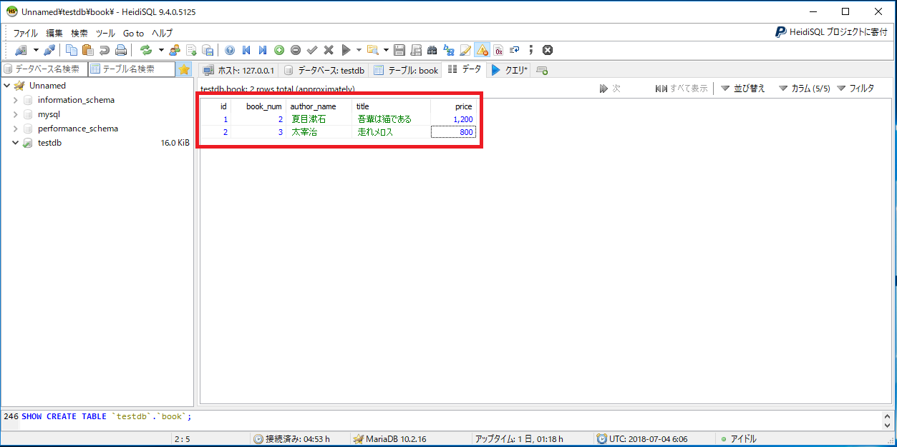{ width=400px }

### データの抽出  (SELECT文)

データの挿入にはSELECT文を実行します。

抽出したいデータに条件を付けるときはテーブル名を記述した後にWhere句をつけて条件を指定することができます。

今回は以下を入力します
``` sql
Select title From book Where id = 1;
```

SELECT文の実行結果クエリータブの下に表示されます。

{ width=400px }

### データの更新  (UPDATE文)

データの更新にはUPDATE文を実行します。  
構文は以下のようになります。

```
UPDATE テーブル名　SET カラム名 = 更新後の値 WHERE 条件
```

今回は以下のように入力します。
``` sql
Update book Set price = 1300 Where id = 1;
```

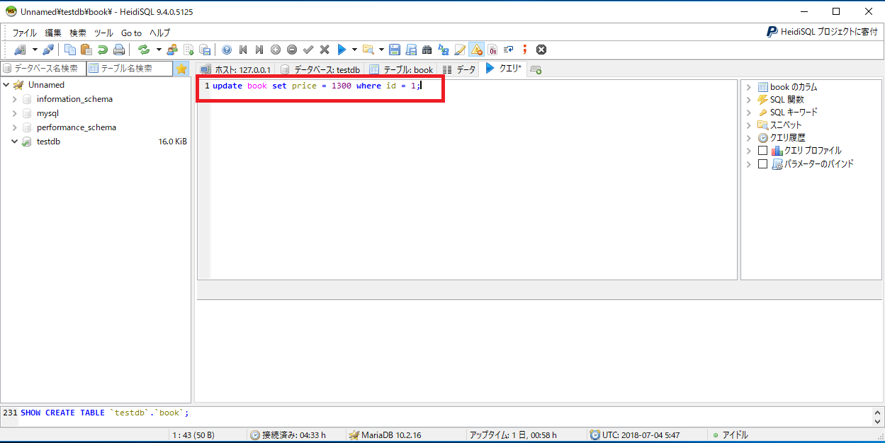{ width=400px }

\newpage

実行結果はデータタブから確認できます。

{ width=400px }

### データの削除  (DELETE文)

データの削除にはDELETE文を実行します。  
構文は DELETE FROM テーブル名 WHERE 条件 となります。  
今回は以下を入力します。

```sql
Delete * From book Where id = 2;
```

{ width=400px }

データが削除されているか、データタブを表示して確認します。

{ width=400px }

### テーブル一覧

作成したテーブルは画面右側のデータベースタブをクリックします。  
また、各テーブルの構造はデータベースタブに表示されたテーブル名をクリックし、確認します。

# データベースで使用できる型を学ぶ

このセクションでは、テーブルに登録できる型を紹介します。

## 数値

データベースに登録できる数値の型は次の２種類が代表的に挙げられます。

### INTEGER

INTEGER型は整数型とよばれるものです。  
表現できる数値の範囲は、最小値-2,147,483,648から最大値+2,147,483,647までです。

### DECIMAL

DECIMAL型は固定小数点型とよばれ,小数を表現することができます。  
表現できる数値の範囲は精度とスケールによって変化します。  
例：精度 = 5,スケール=2 の場合  
DECIMAL(5,2) と表現され、-999.99 から+999.99までの表現が可能です

## 文字列

文字列を表現するデータ型は以下２種類が挙げられます。

### CHAR

固定長の文字列型です。値の範囲は0から256までです。  
長さを固定するために、文字数が長さに満たない場合は空白スペースで長さを満たします。  
以上のことから、文字列としての長さが一定である型となります。

### VARCHAR

可変長の文字列型です。値の範囲は0から65536までです。  
データのサイズが255より小さい場合は1バイトプレフィクスとして格納され  
より大きい場合は2バイトプレフィクスとして格納されます。

### CHARとVARCHARの使い分け

文字列として、空白を用いる場合はVARCHARを推奨します。  
理由としては、CHARが文字列の長さを満たすために空白を文字列に追加するためです。  
逆に格納する文字列が一定であるならばCHAR型を推奨します。  
必要十分な長さを用意できることや、長さより大きい値を格納する心配がありません。

### 日本語(マルチバイト文字)の取り扱い

日本語を扱う際にマルチバイト文字というものに気を付ける必要があります。  
マルチバイト文字とは1文字を複数バイトで表現する体系です。  

日本語をデータベースに登録したときに、実際のデータが文字化けする現象が
発生する場合があります。  
これは、データベースがマルチバイト文字を認識できないため発生する現象です。  
文字化けが発生した場合の対処法は以下の操作を行います。  
データベースの文字コードを編集します。  
画面左のデータベースを右クリックし、編集をクリックします。

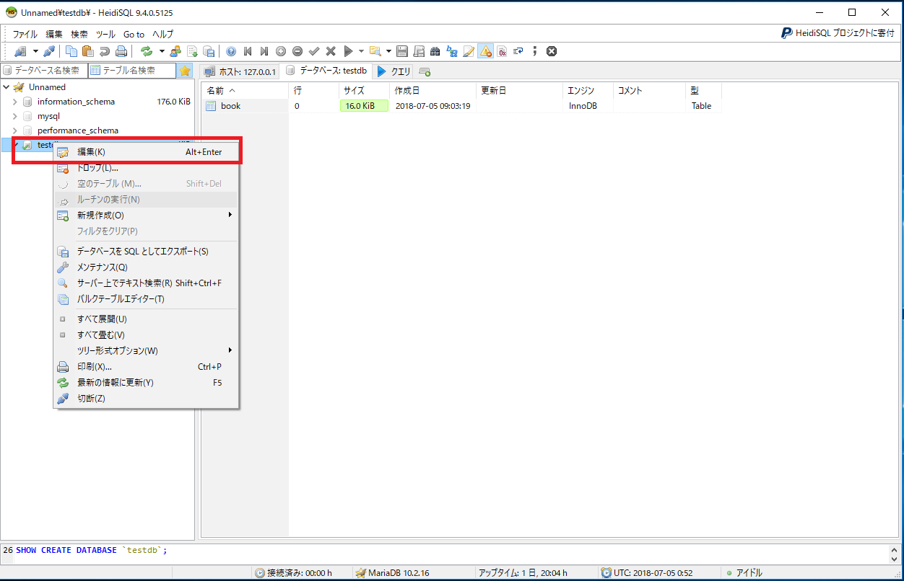{ width=400px }

\newpage

データベース作成という画面の照合をutf8_general_ciに変更します。

{ width=400px }

これで、マルチバイト文字の認識が可能になります。

## 日時

### DATE

DATE型は日付を表現できるデータ型です。  
データは'YYYY-MMMM-DD'形式で表現されます。

### TIME

TIME型は時間を表現できるデータ型です。  
データは'HH:MM:SS'形式で表現されます。

### DATETIME

DATETIME型は日付と時間を表現できるデータ型です。  
データは'YYYY-MMMM-DD HH:MM:SS'形式で表現されます。

### TIMESTAMP

TIMESTANP型は現在の日付・時間を表現できるデータ型です。  
データは'1970-01-01 00:00:01'から'2038-01-19 03:14:07'までの範囲で取得されます。

### YYYY

YEAR型は年を表現できるデータ型です。  
データは'YYYY'形式で表現されます。

## 真偽値

MariaDBでは、TINYINT型を使用することで真偽値を表現することができます。

値を1に設定するとtrueと等しくなります。  
値を0に設定するとfalseと等しくなります。  
ただし、それ以外の値はtrueともfalseとも等しくなくなります。

