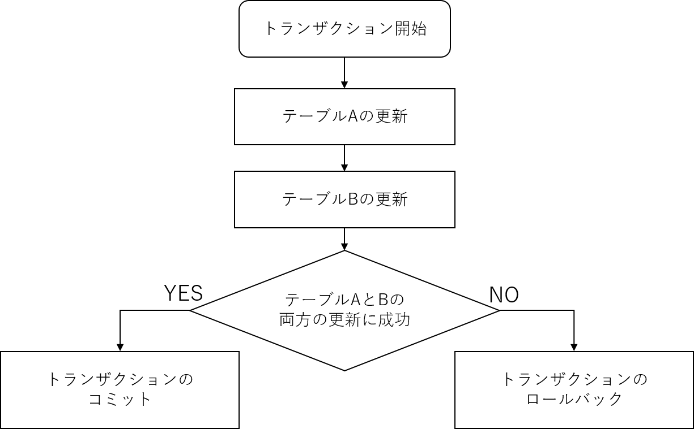

# データベース応用編

## 数値・文字の演算をしてみる

### 演算子

SQLの発行する際に、値に対して演算子を使用して計算することが出来ます。

例として、以下のSQLを発行したとします。

```sql
SELECT ID, NAME, PRICE * 1.08 FROM テーブル
```

すると、IDとNAMEの項目はそのまま取得されますが、
PRICEについては1.08倍された値が取得されます。

例として、以下のようなテーブルを想定します。

|ID|NAME|PRICE|
|--|---|--:|
|1|冷蔵庫| 98000|
|2|洗濯機| 48000|
|3|扇風機| 9800|

取得したテーブルは以下のようになります。

|ID|NAME|PRICE*1.08|
|--|---|---:|
|1|冷蔵庫| 105840|
|2|洗濯機| 51840|
|3|扇風機| 10584|

### AS句による別名取得

カラムに対して演算を行った場合、その計算式がそのままカラム名として取得されます。  
その際に、「AS」句を付与することで、別名を付けて取得することが出来ます。

例として、前項で使用したSQLを変更します。

```sql
SELECT ID, NAME, PRICE * 1.08 AS TOTAL FROM テーブル
```

すると、以下のように取得できます。

|ID|NAME|TOTAL|
|--|---|---:|
|1|冷蔵庫| 105840|
|2|洗濯機| 51840|
|3|扇風機| 10584|

このように、演算を用いた取得をする場合には、
積極的にAS句を使用することで分かりやすい結果を得ることが出来ます。

## if case

値の取得の際に、条件によって取得内容を変更することが出来ます。
例として以下のSQLを発行したとします。

```sql
SELECT
    ID, NAME, 
    case when PRICE > 10000 then
        '高'
    else then
        '安'
    end as TYPE
FROM テーブル
```

## 集計をする

### 条件に合致する件数を取得する(COUNT)

テーブルを検索する際、条件に応じた件数を取得する事が出来ます。

例として、値段が10,000円以下の商品を取得します。

```sql
SELECT COUNT(*) AS COUNT FROM テーブル WHERE PRICE <= 10000
```

すると、以下のような結果を得ることが出来ます。

|COUNT|
|---:|
|1|

### 数値項目の集計を行う

SQLを用いて、数値項目の集計をすることができます。

使用できる関数は以下の通りです。

| 関数名 | 説明 | 解説 | 
|--|--|--|
|SUM()| 総和   | 引数に指定したカラムの総和を求める |
|MAX()| 最大値 | 引数に指定したカラムの最小値を求める|
|MIN()| 最小値 | 引数に指定したカラムの最大値を求める|
|AVG()| 平均   | 引数に指定したカラムの平均を求める|

例として、40代の社員の平均給与を求めます。

```sql
SELECT 
  AVG(社員.給与) AS 平均給与 
FROM 
  社員 
WHERE 
  社員.年齢 => 40 AND 社員.年齢 < 50
```

すると、以下のような結果を得ることができます。

|平均給与 |
|---:|
|465.3|

## サブクエリを使用する

## 保存処理とトランザクション

### トランザクションとは

トランザクションとは、「連続して実行する必要のある一連の処理」を指します。

例えば、商品が売れた際に
「在庫」と「売上」の2つのテーブルを更新することを考えます。

この際、在庫の減算処理と売上の加算処理を行いますが、
在庫の処理は成功したが、売り上げの処理が失敗した場合に
整合が取れなくなってしまいます。

このような問題が発生する場合に、トランザクションを使用して解決します。

例として、テーブルAとテーブルBの更新を行うトランザクションを考えます。

トランザクションの流れは以下のようになります。

{width=420px}

以下で、各項目の説明をします。

### トランザクション開始

トランザクション内で更新処理を行う場合、
まず初めに「トランザクション開始」を行います。

### トランザクションのコミット

トランザクション中の処理をテーブに反映し、トランザクションを終了することを「コミット」といいます。
コミットすることで、それまでのテーブルに対する変更を反映させます。

### トランザクションのロールバック

トランザクションの中の処理をすべて取りやめ、
トランザクションの開始時まで戻してトランザクションを終了させる処理を「ロールバック」といいます。

ロールバックを行うと、
トランザクション開始部分までテーブル情報を戻します。

